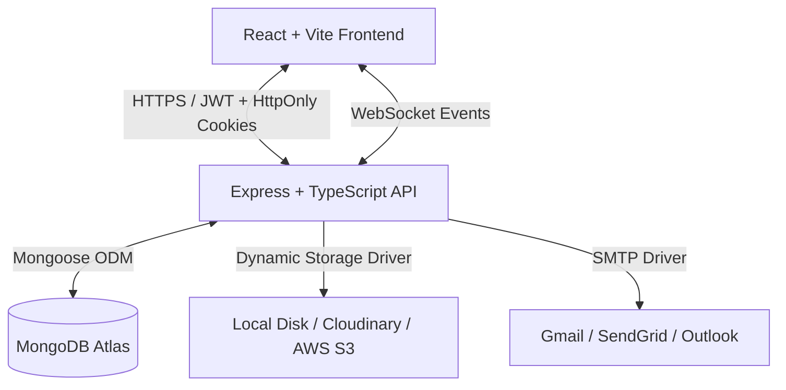

# 🚀 BlogHub: Production-Grade Full-Stack Blog Application

A premium, production-ready, fully-hardened personal blogging platform featuring a modern **React & Vite** frontend, a scalable **Node.js, Express & TypeScript** backend, and robust **MongoDB** integration.

Designed with high security, Role-Based Access Control (RBAC), automatic token rotation, and dynamic cloud media storage.

---

## 🏗️ Architecture Overview

The system is split into two main packages, organized in a clear workspace structure:



### 💻 Technologies Used

| Layer | Technology | Key Modules & Packages |
|---|---|---|
| **Frontend** | React (Vite) | TailwindCSS, TanStack React Query, React Router v6, Lucide icons, Framer Motion |
| **Backend** | Node.js (TypeScript) | Express, Mongoose ODM, Socket.IO, Zod validation, Multer |
| **Security** | Owasp Top 10 Protections | bcrypt (12 rounds), JsonWebToken, Helmet, Express Rate Limit, express-mongo-sanitize |
| **Log/Monitor**| Diagnostic Tools | Winston Structured Logging (Daily rotate file), Health metrics |

---

## 🔒 Hardened Security Implementations

This system has been architected to conform to modern web security best practices:

* **HttpOnly Session Cookes:** Access tokens are stored in memory while refresh tokens are set in secure, `HttpOnly`, `SameSite: Strict` cookies, shielding the application from Cross-Site Scripting (XSS) credential theft.
* **Refresh Token Rotation (RTR):** Rotation is enforced on token refresh. If a reused refresh token is detected (indicating token theft), **all active sessions** for that user are immediately revoked.
* **Forced Logout Policies:** Changing a password or requesting a password reset immediately revokes all active login sessions in the database.
* **Role-Based Access Control (RBAC):** Users are granted hierarchical permissions:
  * `Viewer` (Default): Read-only dashboard viewer; cannot mutate content.
  * `Editor`: Can publish, edit, and moderate comments/tags/blogs they own.
  * `Admin`: Full access to user profiles, deletion, system configurations, and session management.
* **Strict XSS Sanitization:** Incoming rich text content and user input (comments, tag names) are sanitized through a server-side HTML parser that strips `<script>`, `<iframe>`, inline handlers (e.g. `onload`), and `javascript:` URIs.
* **Dynamic Storage Engine:** An abstracted image upload manager supporting:
  * **Local File Storage:** Excellent for local development.
  * **Cloudinary & AWS S3:** Supported in production via environment configuration.
  * *Includes file size validation (5MB), MIME verification, filename randomization, and automated orphaned metadata cleanup.*

---

## 🚀 Quick Start Guide

### Prerequisites
* [Node.js](https://nodejs.org/) (v18.0.0 or higher)
* [MongoDB](https://www.mongodb.com/) (Local server or Atlas connection URI)

### 1. Repository Configuration

Clone the repository and install the dependencies for both frontend and backend:

```bash
# Install backend dependencies
cd blog-backend
npm install

# Install frontend dependencies
cd ../blog-frontend
npm install
```

### 2. Environment Configurations

#### Backend Configuration
Create a `.env` file inside `blog-backend/` based on [blog-backend/.env.example](file:///c:/GitHub/Working-GitHub/Personal%20Blogs/blog-backend/.env.example):

```env
PORT=5000
NODE_ENV=development
FRONTEND_URL=http://localhost:5173

MONGODB_URI=mongodb://localhost:27017/blog
JWT_SECRET=your_secure_64_character_jwt_access_secret_key
JWT_EXPIRE=15m
JWT_REFRESH_SECRET=your_secure_64_character_jwt_refresh_secret_key
JWT_REFRESH_EXPIRE=7d

STORAGE_PROVIDER=local
MAX_FILE_SIZE=5242880
ALLOWED_FILE_TYPES=image/jpeg,image/png,image/webp,image/gif
```

#### Frontend Configuration
Create a `.env` file inside `blog-frontend/` configured with:

```env
VITE_API_URL=http://localhost:5000/api
```

### 3. Database Seeding
Execute the database seeding script to populate initial blogs, categories, tags, and creates the default Admin user (`admin@blog.com` / `Admin@123`):

```bash
cd blog-backend
npm run seed
```

### 4. Running the Application locally

Start both dev servers in parallel:

```bash
# In the blog-backend directory
npm run dev

# In the blog-frontend directory
npm run dev
```

The frontend will start on [http://localhost:5173](http://localhost:5173) and backend API on [http://localhost:5000](http://localhost:5000).

---

## 🌐 Production Deployment & Pipelines

### Backend Build
Compile the TypeScript code to JavaScript:
```bash
cd blog-backend
npm run build
npm start
```

### Frontend Build
Compile and bundle the React assets with Vite:
```bash
cd blog-frontend
npm run build
npm run preview
```

### Deployment Configuration Checklist
1. Enable `trust proxy` in `app.ts` if running behind Nginx, Cloudflare, or AWS ELB.
2. Ensure `STORAGE_PROVIDER` is set to `cloudinary` or `s3` with credentials.
3. Configure `SMTP_*` SMTP credentials for contact forms and comments alerts.
4. Keep `NODE_ENV` as `production`.
5. Rotate standard keys and set up automated MongoDB backups.
